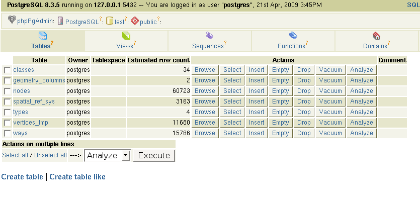

:Author: Kai Behncke (edited by Daniel Kastl)
:License: Creative Commons

.. _osmdata:

================================================================
 Working with OpenStreetMap data
================================================================

In that case as an example from Osnabrück ... (in lower saxony(Germany))

Getting your own OpenStreetMap-Routing-data is not the easiest step in the world.
You know that you need data with a real topology?

In generel Shapefiles should have one, but be very carefull with OSM-Shapefiles.
For most thing they work very nice, you get them e.g. from here:
http://download.geofabrik.de/osm/

But please don`t use these Shapefiles (and shp2pgsql) for a routing and have a 
look at that discussion:

http://lists.postlbs.org/pipermail/pgrouting-users/2009-April/000096.html

Many thanks to Daniel KASTL who brought the needed information:

	... shp2pgsql imports the geometry correctly, but the topology function will 
	not work with how OSM represents their ways, because ways consist (can 
	consist) of more than one edge often.

	osm2pgrouting cares about this and splits a way into more edges if they 
	cross each other. It then automatically does the assign_vertex topology 
	script and adds a few more tables to keep information about road types and 
	classes.
	

To get your own data you need to work with .osm (XML) files.

Please download the .osm-data from lower saxony (niedersachsen.osm.bz2) , e.g. from here:

http://download.geofabrik.de/osm/europe/germany/

And then install osmosis, a very nice tool to work with osm-data, 
The wiki-site for osmosis you find here:

http://wiki.openstreetmap.org/wiki/Osmosis

You need to extract the data from Osnabrück out of Lower saxony, it works like that:

.. code-block:: bash

	osmosis --read-xml niedersachsen.osm --bb left=7.917 right=8.1694 \
					top=52.3537 bottom=52.3537 --write-xml osnabrueck.osm

Now, you have the "real"-OSM-XML-Data from Osnabrück but without a topology.

For that you need the tool "osm2pgrouting". After you have loaded the .osm-File 
in the database via osm2pgrouting, the table-structure should look like:

