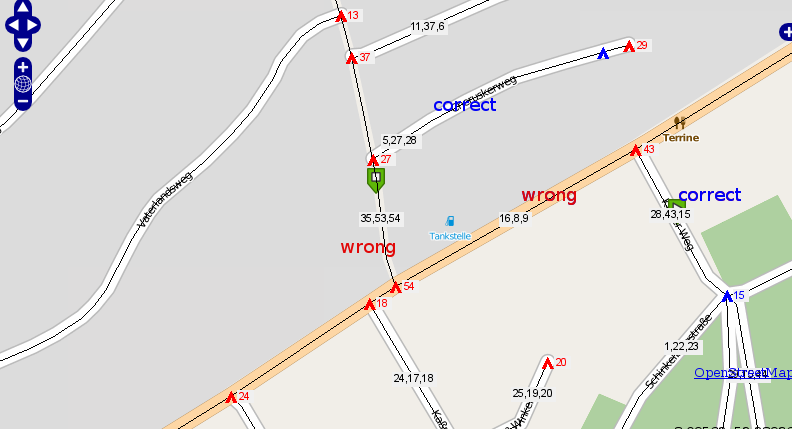

:Author: Kaib Behncke (edited by Daniel Kastl)
:License: Creative Commons

.. _validation:

================================================================
 Network data validation
================================================================

An important thing is to test if your data work properly for routing.

If you are more or less fit to UMN MapServer you can easily do some tests.

First of all many thank to Stephen WOODBRIDGE for that idea.

You need to type the following commands on your vertices_tmp-table

.. code-block:: sql

	alter table vertices_tmp add column cnt integer;
	update vertices_tmp set cnt=0;
	update vertices_tmp set cnt=cnt+1 from ways where ways.source=vertices_tmp.id;
	update vertices_tmp set cnt=cnt+1 from ways where ways.target=vertices_tmp.id;

This will display red dots at dead ends and green dots as good 
connections be segments.

You can visualize it with the UMN MapServer, just take a mapfile like:

.. code-block:: bash

	MAP 

	NAME           'mymap' 
	STATUS ON 
	#EXTENT 3427065.200000 5788323.530000 3443999.370000 5800691.660000
	#EXTENT 7.9189 52.2102 8.1716 52.3467
	EXTENT 880000 6840000 915000 6860000
	IMAGECOLOR 255 255 255
	SIZE      700 700
	SYMBOLSET    	'/your_path/symbols/symbols.sym'
	FONTSET       '/your_path/fonts/fonts.list'

	WEB
	TEMPLATE  'template.html'
	IMAGEPATH '/your_path/tmp/'
	IMAGEURL   '/tmp/'

	METADATA 
	'WMS_TITLE'   'Gastronomap_routing'
	 'WMS_FEATURE_INFO_MIME_TYPE' 'text/html'
	'WMS_ONLINERESOURCE'   'http://localhost/cgi-bin/mapserv?map=/your_path/routing.map' 		
		'WMS_SRS'       "EPSG:900913"	
	  END 
	END 

	PROJECTION 
	'init=epsg:900913'
	END 

	LAYER 
	OFFSITE 255 255 255
	#LABELITEM 'name'
	TOLERANCE 20
	NAME		'streets' 
	TYPE		LINE
	STATUS	DEFAULT
	CONNECTIONTYPE postgis
	CONNECTION 'user=postgres password=postgres dbname=routing host=localhost port=5432'
	DATA 'the_geom from ways as foo using unique gid using SRID=900913'
	CLASSITEM 'gid'
	TEMPLATE 'ausgabe.phtml'

	METADATA 
	'WMS_TITLE'   'streets' 
	'WMS_SRS'    "EPSG:900913"	
	'WMS_INCLUDE_ITEMS' 'all'	
	END 

	CLASS 
	TEXT ([gid],[source],[target])
	EXPRESSION /./

	STYLE 
	WIDTH 1
	COLOR 0 0 0
	END 

	LABEL 
		TYPE TRUETYPE 
		ANTIALIAS TRUE 
		FONT 'arial' 
		COLOR 0 0 0 
		BACKGROUNDCOLOR 240 240 240 
		 POSITION cc
		  MINSIZE 8
		MAXSIZE 12
	  	BUFFER 2
		 END 
	END 
	END

	LAYER 
	OFFSITE 255 255 255
	#LABELITEM 'name'
	TOLERANCE 20
	NAME		'dead_ends' 
	TYPE		POINT
	STATUS	DEFAULT
	CONNECTIONTYPE postgis
	CONNECTION 'user=postgres password=postgres dbname=routing host=localhost port=5432'
	DATA 'the_geom from vertices_tmp as foo using unique id using SRID=900913'

	CLASSITEM 'cnt'
	TEMPLATE 'ausgabe.phtml'

	METADATA 
	'WMS_TITLE'   'dead_ends' 
	'WMS_SRS'    "EPSG:900913"	
	'WMS_INCLUDE_ITEMS' 'all'	
	END 
	CLASS 
	Text ([id])
	EXPRESSION /1/
	STYLE 
	SYMBOL 'tent'
	SIZE 11
	COLOR 255 0 0
	END 

	LABEL 
		TYPE TRUETYPE 
		ANTIALIAS TRUE 
		FONT 'arial' 
		COLOR 255 0 0
		BACKGROUNDCOLOR 240 240 240 
		 POSITION cr
		  MINSIZE 8
		MAXSIZE 12
	  	BUFFER 2
		 END 
	END 

	CLASS 
	TEXT ([id])
	EXPRESSION /./

	STYLE 
	SYMBOL 'tent'
	SIZE 11
	COLOR 0 0 255
	END 

	LABEL 
		TYPE TRUETYPE 
		ANTIALIAS TRUE 
		FONT 'arial' 
		COLOR 0 0 255 
		BACKGROUNDCOLOR 240 240 240 
		 POSITION cr
		  MINSIZE 8
		MAXSIZE 12
	  	BUFFER 2
		 END 
	END 
	END
	END 

If you open your MapServer-testing-apllication via:
http://localhost/cgi-bin/mapserv?map=/var/www/gastronomap_wms/gastronomap_routing.map

and you zoom in you get something like:

.. image:: img/correct_vertices.png
  :scale: 65%
  :align: center

Everything fine with the data ! :-)

But if it looks like:

Definetely something went wrong........
