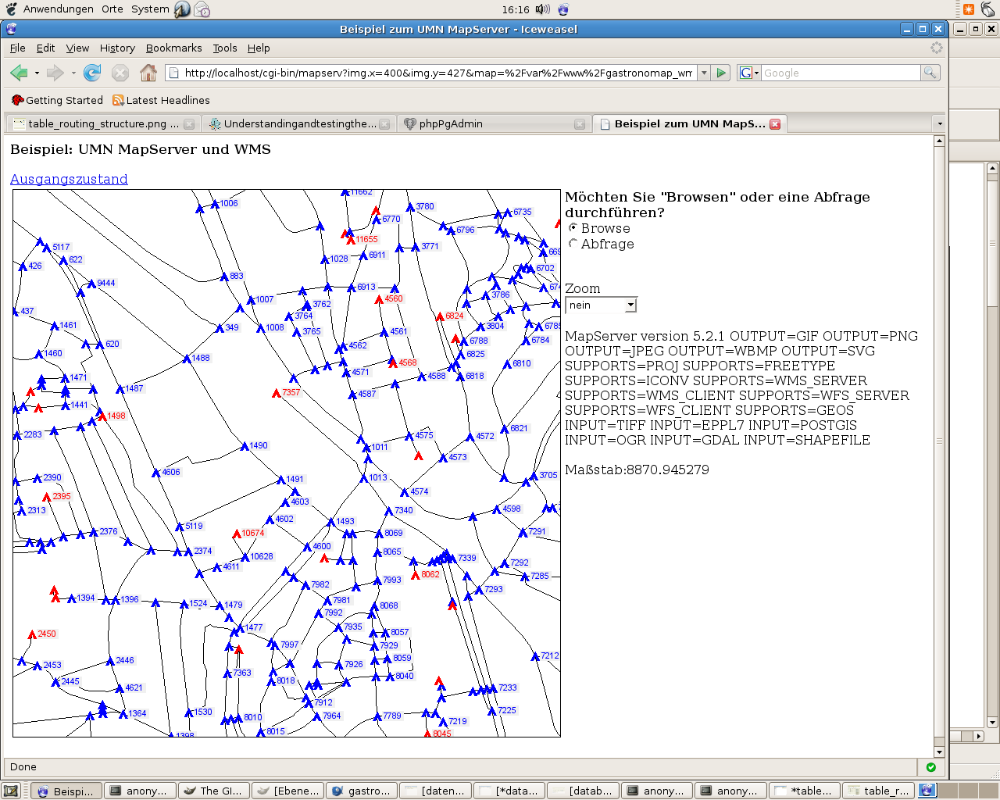

:Author: Kai Behncke (edited Daniel Kastl)
:License: Creative Commons

.. _ol-workshop-ch04:

================================================================
 Transforming, describing and testing the data
================================================================

After you have loaded the .osm-File in the database via osm2pgrouting, the table-structure should look like:

.. image:: img/database.png
  :scale: 100%
  :align: center

You need to know: The geodata from OSM lie in the WGS84-reference-system, that 
has the epsg-code:4326.

For our tutorial we work with the "Google-Projection" that has the epsg-code 900913.

First of all you need to bring the code for 900913 in the database and in the 
epsg-file of the proj-library.

Be carefull: Different codes for 900913 exist (it took me a couple of hours to 
understand that this was the reason, that my geodata were located 80 kilometers 
too much in the south), so, as an SQL-command use the following to bring 900913 
in the spatial_ref_sys-table:

.. code-block:: sql

	INSERT INTO spatial_ref_sys (srid, auth_name, auth_srid, srtext, proj4text) VALUES (900913, 'EPSG', 900913,
	'PROJCS["unnamed",GEOGCS["unnamed ellipse",DATUM["unknown",SPHEROID["unnamed",6378137,0]],
	PRIMEM["Greenwich",0],UNIT["degree",0.0174532925199433]],
	PROJECTION["Mercator_2SP"],PARAMETER["standard_parallel_1",0],PARAMETER["central_meridian",0],PARAMETER["false_easting",0],
	PARAMETER["false_northing",0],UNIT["Meter",1],EXTENSION["PROJ4","+proj=merc +a=6378137 +b=6378137 
	+lat_ts=0.0 +lon_0=0.0 +x_0=0.0 +y_0=0 +k=1.0 +units=m +nadgrids=@null +wktext  +no_defs"]]',
	 '+proj=merc +a=6378137 +b=6378137 +lat_ts=0.0 +lon_0=0.0 +x_0=0.0 +y_0=0 +k=1.0 +units=m +nadgrids=@null +wktext  +no_defs');

In the epsg-file (should be in /usr/local/share/proj/epsg) write at the end:

.. code-block:: bash

	<900913> +proj=merc +a=6378137 +b=6378137 +lat_ts=0.0 +lon_0=0.0 +x_0=0.0 +y_0=0 +k=1.0 +units=m +nadgrids=@null +no_defs

... so you have the possibility now to transform your geodata.

To get that, you need to remove the constraint that your geodata has to be in 4326. 
After that rename the column "the_geom" in the table ways to "the_geom_4326"
and add a new column "the_geom" (as geometry).

After that you need to change the table geometry_columns. You need to type that 
the srid for the_geom (table ways & and vertices_tmp) is 900913 as well (!!!)

Then do the SQL-command:.

.. code-block:: sql

	UPDATE ways SET the_geom=transform(the_geom_4326,900913)

...and your data in the_geom exist in the "Google Projection".

Furthermore you need to add a column "id" (integer) to the table "ways" to work with the routing-alorithm.

If you have that column just do the command:

.. code-block:: sql

	UPDATE ways SET id=gid;

After that the table-structure of "ways" should look like:

.. image:: img/table_routing_structure.png
  :scale: 100%
  :align: center

To be used for Dijkstra-algorithm every geometry needs to have a source and a 
target-value. These values needs to be identic with the id-numbers of the table 
"vertices_tmp".

The next screenshot shows how it shouldn't (!!) look like:

.. image:: img/weird_numbers.png
  :scale: 90%
  :align: center

(the three numbers black on grey show the gid,source and target-values of the 
"ways"-table. The red-colured numbers are "dead ends", and the blue-one correct 
vertices of "vertices_tmp"). This result comes from OSM-Shape-files ...

**How to test the geodata?**

First of all many thank to Stephen WOODBRIDGE for that idea.

You need to type the following commands on your vertices_tmp-table

.. code-block:: sql

	alter table vertices_tmp add column cnt integer;
	update vertices_tmp set cnt=0;
	update vertices_tmp set cnt=cnt+1 from ways where ways.source=vertices_tmp.id;
	update vertices_tmp set cnt=cnt+1 from ways where ways.target=vertices_tmp.id;

This will display red dots at dead ends and green dots as good 
connections be segments.

You can visualize it with the UMN MapServer, just take a mapfile like::

	MAP 
		NAME 'mymap' 
		STATUS ON 
		EXTENT 880000 6840000 915000 6860000
		IMAGECOLOR 255 255 255
		SIZE 700 700
		SYMBOLSET '/your_path/symbols/symbols.sym'
		FONTSET '/your_path/fonts/fonts.list'

		WEB
			TEMPLATE  'template.html'
			IMAGEPATH '/your_path/tmp/'
			IMAGEURL   '/tmp/'

			METADATA 
		  		'WMS_TITLE'   'Gastronomap_routing'
				'WMS_FEATURE_INFO_MIME_TYPE' 'text/html'
				'WMS_ONLINERESOURCE'   'http://localhost/cgi-bin/mapserv?map=/your_path/routing.map' 		
				'WMS_SRS'       "EPSG:900913"	
			END 
		END 

		PROJECTION 
			'init=epsg:900913'
		END 

		LAYER 
			OFFSITE 255 255 255
			#LABELITEM 'name'
			TOLERANCE 20
			NAME		'streets' 
			TYPE		LINE
			STATUS	DEFAULT
			CONNECTIONTYPE postgis
			CONNECTION 'user=postgres password=postgres dbname=routing host=localhost port=5432'
			DATA 'the_geom from ways as foo using unique gid using SRID=900913'
			CLASSITEM 'gid'
			TEMPLATE 'ausgabe.phtml'

			METADATA 
				'WMS_TITLE'   'streets' 
				'WMS_SRS'    "EPSG:900913"	
				'WMS_INCLUDE_ITEMS' 'all'	
			END 

			CLASS 
				TEXT ([gid],[source],[target])
				EXPRESSION /./

				STYLE 
					WIDTH 1
					COLOR 0 0 0
				END 

				LABEL 
					TYPE TRUETYPE 
					ANTIALIAS TRUE 
					FONT 'arial' 
					COLOR 0 0 0 
					BACKGROUNDCOLOR 240 240 240 
					POSITION cc
					MINSIZE 8
					MAXSIZE 12
					BUFFER 2
				END 
			END 
		END

		LAYER 
			OFFSITE 255 255 255
			#LABELITEM 'name'
			TOLERANCE 20
			NAME		'dead_ends' 
			TYPE		POINT
			STATUS	DEFAULT
			CONNECTIONTYPE postgis
			CONNECTION 'user=postgres password=postgres dbname=routing host=localhost port=5432'
			DATA 'the_geom from vertices_tmp as foo using unique id using SRID=900913'

			CLASSITEM 'cnt'
			TEMPLATE 'ausgabe.phtml'

			METADATA 
				'WMS_TITLE'   'dead_ends' 
				'WMS_SRS'    "EPSG:900913"	
				'WMS_INCLUDE_ITEMS' 'all'	
			END 
	
			CLASS 
				Text ([id])
				EXPRESSION /1/
		
				STYLE 
					SYMBOL 'tent'
					SIZE 11
					COLOR 255 0 0
				END 

				LABEL 
					TYPE TRUETYPE 
					ANTIALIAS TRUE 
					FONT 'arial' 
					COLOR 255 0 0
					BACKGROUNDCOLOR 240 240 240 
					POSITION cr
					MINSIZE 8
					MAXSIZE 12
					BUFFER 2
				END 
			END 

			CLASS 
				TEXT ([id])
				EXPRESSION /./

				STYLE 
					SYMBOL 'tent'
					SIZE 11
					COLOR 0 0 255
				END 

				LABEL 
					TYPE TRUETYPE 
					ANTIALIAS TRUE 
					FONT 'arial' 
					COLOR 0 0 255 
					BACKGROUNDCOLOR 240 240 240 
					POSITION cr
					MINSIZE 8
					MAXSIZE 12
					BUFFER 2
				END 
			END 
		END
	END 

If you open your MapServer-testing-apllication via:
http://localhost/cgi-bin/mapserv?map=/var/www/gastronomap_wms/gastronomap_routing.map

and you zoom in you get something like:

Everything fine with the data ! :-)

