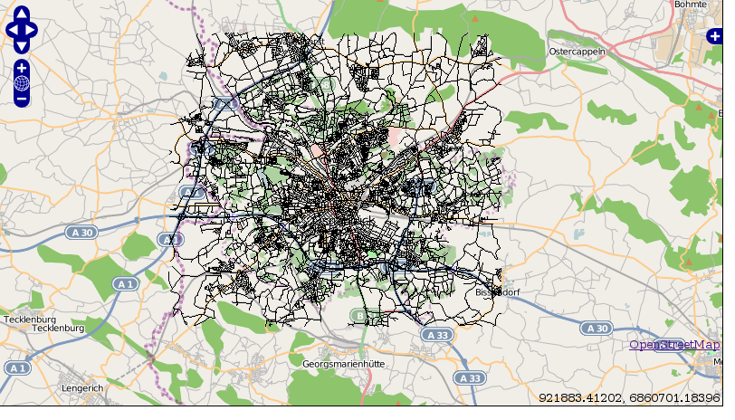

:Author: Kai Behncke (edited Daniel Kastl)
:License: Creative Commons

.. _ol-workshop-ch07:

================================================================
 Explanation of the OpenLayers-Code step 2
================================================================

You might want to test if you routing-data are located correctly above the 
OpenLayers-OSM-Application, just take away the // at

.. code-block:: js

   var wms= new OpenLayers.Layer.WMS.Untiled( "strassen",

        "http://localhost/cgi-bin/mapserv?map=/your_path/routing.map",

           {layers: 'streets',transparent:true, format: 'png'}); 
           

	wms.isBaseLayer= false;         

and write also:

.. code-block:: js

	map.addLayers([mapnik, start, stop,result,wms]); 

In the mapfile you should comment out

.. code-block:: bash

	#TEXT ([gid],[source],[target])

and you will get a screen like:

[[Great!!!!!]], so you know that the routing-data are on the right position in 
the map!! If you want you can turn off the WMS.

Some more explanations of the OpenLayers-Code:

.. code-block:: js

   var options = {
        projection: new OpenLayers.Projection("EPSG:900913"),
        displayProjection: new OpenLayers.Projection("EPSG:4326"),
        units: "m",
        numZoomLevels: 22,
        maxResolution: 156543.0339,
        maxExtent: new OpenLayers.Bounds(-20037508, -20037508,
                                         20037508, 20037508.34)                                               
    };

    map = new OpenLayers.Map('map', options);
    map.addControl(new OpenLayers.Control.LayerSwitcher());
          

Projection and extend (of the Google-Mercator.projection) are set.
Also a map-object is created and a Layerswitcher integrated.
Coordinates are shown in WGS84 ( displayProjection: new OpenLayers.Projection("EPSG:4326"),
).

.. code-block:: js

       function osm_getTileURL(bounds) {

            var res = this.map.getResolution();

            var x = Math.round((bounds.left - this.maxExtent.left) / (res * this.tileSize.w));

            var y = Math.round((this.maxExtent.top - bounds.top) / (res * this.tileSize.h));

            var z = this.map.getZoom();

            var limit = Math.pow(2, z);

            if (y < 0 || y >= limit) {

                return OpenLayers.Util.getImagesLocation() + "404.png";

            } else {

                x = ((x % limit) + limit) % limit;

                return this.url + z + "/" + x + "/" + y + "." + this.type;

            }

        } 

With that function you get OSM-Tiles for the layer mapnik:

.. code-block:: js

                    // create OSM layer

            var mapnik = new OpenLayers.Layer.TMS(

                "OpenStreetMap (Mapnik)",

                  "http://a.tile.openstreetmap.org/",

                {

                    type: 'png', getURL: osm_getTileURL,

                    displayOutsideMaxExtent: true,

                    attribution: '<a href="http://www.openstreetmap.org/">OpenStreetMap</a>'

                }

            );  
          

**And very important!**

Very important is the following code-snippet:

.. code-block:: js

	if (startPoint && stopPoint) {

		OpenLayers.loadURL("routing.php?startpoint="+startPoint.geometry.x+" "+startPoint.geometry.y+"&finalpoint="+stopPoint.geometry.x+" "+stopPoint.geometry.y+"&method=SPD&srid=900913",
                                   null,
                                   null,
                                   displayRoute,
                                   null);                                   
                                   
            }
        }

    function displayRoute(response) {
        if (response && response.responseXML) {
        
            // erase the previous results
            result.removeFeatures(result.features);

	function parseWKT(wkt) {
       parser = new OpenLayers.Format.WKT();
           var geometry = parser.read(wkt)
            var features = parser.read(wkt);
            var bounds;
            if(features) {
       
                if(features.constructor != Array) {
                    features = [features];
                }
                for(var i=0; i<features.length; ++i) {
                    if (!bounds) {
                        bounds = features[i].geometry.getBounds();
                    } else {
                        bounds.extend(features[i].geometry.getBounds());
                    }
                    
                }
             result.addFeatures(features);

            } else {
            alert ("wrong");
                element.value = 'Bad WKT';
            }
        }
                // parse the features
                var edges = response.responseXML.getElementsByTagName('edge');
                var features = [];
                for (var i = 0; i < edges.length; i++) {
                    var g = parseWKT(edges[i].getElementsByTagName('wkt')[0].textContent);
                    features.push(new OpenLayers.Feature.Vector(g));
                }
                result.addFeatures(features);
            }

If start- and endpoint are set and you click on "calculate route" via Ajax an 
URL is called with the coordinates of start and end-points

(OpenLayers.loadURL("routing.php?startpoint="+startPoint.geometry.x+" "+startPoint.geometry.y+"&finalpoint="+stopPoint.geometry.x+" )

routing.php creates the geometry of the routing-ways
(We will come to routing.php in the next step).

If these ways are correctly given back to our OpenLayers-script "parseWKT" is called.
This parses the given "Well Known text-geodata" from routing.php.

In

.. code-block:: js

       for (var i = 0; i < edges.length; i++) {
                    var g = parseWKT(edges[i].getElementsByTagName('wkt')[0].textContent);
                    features.push(new OpenLayers.Feature.Vector(g));
                }
                result.addFeatures(features);

the geometry is parsed and set as a new Feature to the layer result.

