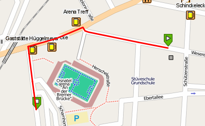

:Author: Kai Behncke (edited Daniel Kastl)
:License: Creative Commons

.. _ol-workshop-ch09:

================================================================
 Function for Filling the gaps (green markers to the vertices)
================================================================

At the end of the day you will wan`t to have a route that goes from the
start-marker to the end-marker (nevertheless if the markers are above vertices or not)

What you need is a function (or in that case two functions) that finds

a) the nearest points on a road from the click point

b) Calculates then the geometry from the first points pgRouting draws (also without these functions) to the point that is the nearest from the click point.

For a) use the following SQL in the database:

.. code-block::

	CREATE OR REPLACE FUNCTION multiline_locate_point(amultils geometry,apoint geometry)

		RETURNS geometry AS

	$BODY$

	DECLARE
		mindistance float8;
		nearestlinestring geometry;
		nearestpoint geometry;
		i integer;

	BEGIN
		mindistance := (distance(apoint,amultils)+100);
		FOR i IN 1 .. NumGeometries(amultils) LOOP
		    if distance(apoint,GeometryN(amultils,i)) < mindistance THEN
		        mindistance:=distance(apoint,GeometryN(amultils,i));
		        nearestlinestring:=GeometryN(amultils,i);
		    END IF;
		END LOOP;

	nearestpoint:=line_interpolate_point(nearestlinestring,line_locate_point(nearestlinestring,apoint));
		RETURN nearestpoint;
	END;

	$BODY$

		LANGUAGE 'plpgsql' IMMUTABLE STRICT;

For b)

use the folowing SQL

.. code-block:: html

	CREATE OR REPLACE FUNCTION give_we_wkt(gid_a integer,gid_b integer,start geometry)

		RETURNS geometry AS

	$BODY$

	DECLARE
	intercept_point geometry;
	number_of_points integer;
	first_point_of_geometry geometry;
	j integer;
	point_geom geometry;
	line text;
	mywkt text;
	p text;
	new_factor integer;
	endgeometry geometry[] := '{}';

	BEGIN

	RAISE NOTICE 'Here we go........';

	--Give me the intercept point of two geometries we use......
	intercept_point:= ST_astext(intersection(a.the_geom, b.the_geom)) from (select the_geom from ways where gid=$1)a, (select the_geom from ways where gid = $2) b;

	RAISE NOTICE 'intercept_point %',astext(intercept_point);

	-- Give me the number of points  of the geometry we touch with the start-point
	number_of_points:=ST_NumPoints(the_geom) from ways where gid=$1;

	mywkt:='';
	line:='';

	RAISE NOTICE 'Numer of points in that geometry is %',number_of_points;

	first_point_of_geometry:=PointN(c.the_geom,1) from (select (the_geom) from ways where gid=$1)c,ways where gid=$1;

	-- If intercept_point and first point of geometry (with start point) is equal
	IF astext(intercept_point)=astext(first_point_of_geometry) THEN

	RAISE NOTICE 'Equal!!';

	FOR j IN 1 .. number_of_points LOOP

	point_geom:=PointN(c.the_geom,j) from (select (the_geom) from ways where gid=$1)c,ways where gid=$1;

	RAISE NOTICE 'Call: %',j;
	endgeometry[j]:=point_geom;

	RAISE NOTICE 'The point is %',astext(point_geom);

	line:='';
	line:= line || X(endgeometry[j])||' '||Y(endgeometry[j])||', '||X(endgeometry[j-1])||' '||Y(endgeometry[j-1]);

	-- A line is build
	line:='LINESTRING'||'(' || line || ')';

	SELECT INTO p ST_intersects(line,buffer($3,1));

	IF j=1 THEN
	mywkt:= mywkt ||X(endgeometry[j])||' '||Y(endgeometry[j])||', ';
	END IF;

	IF p!= 't' THEN
	RAISE NOTICE 'The start point does not touch a part of a multiline';

	mywkt:= mywkt ||X(endgeometry[j])||' '||Y(endgeometry[j])||', ';

	END IF;

	IF p = 't' THEN
	RAISE NOTICE 'Interesting: Start point touches part of multiline, we replace it!!';
	mywkt:= mywkt ||X($3)||' '||Y($3);
	mywkt:='MULTILINESTRING'||'((' || mywkt || '))';
	RAISE NOTICE 'We have got the new geometry: %',mywkt;
	RETURN mywkt;
	END IF;

	END LOOP;

	ELSE

	-- Ok, intercept_point and first point of geometry (with start point)are not equal
	-- We have to go "thr other way round"

	FOR j IN 1 .. number_of_points LOOP

	new_factor:=number_of_points+1-j;

	point_geom:=PointN(c.the_geom,new_factor) from (select (the_geom) from ways where gid=$1)c,ways where gid=$1;

	RAISE NOTICE 'Call number: %',j;
	endgeometry[j]:=point_geom;

	RAISE NOTICE 'The point is at %',astext(point_geom);

	line:='';
	line:= line || X(endgeometry[j])||' '||Y(endgeometry[j])||', '||X(endgeometry[j-1])||' '||Y(endgeometry[j-1]);

	line:='LINESTRING'||'(' || line || ')';

	SELECT INTO p ST_intersects(line,buffer($3,1));

	IF j=1 THEN
	mywkt:= mywkt ||X(endgeometry[j])||' '||Y(endgeometry[j])||', ';
	END IF;

	IF p!= 't' THEN
	RAISE NOTICE 'The start point does not touch a part of a multiline';

	mywkt:= mywkt ||X(endgeometry[j])||' '||Y(endgeometry[j])||', ';

	END IF;

	IF p = 't' THEN
	RAISE NOTICE 'The start point touches a part of a multiline';
	mywkt:= mywkt ||X($3)||' '||Y($3);
	mywkt:='MULTILINESTRING'||'((' || mywkt || '))';
	RAISE NOTICE 'The geometry is %',mywkt;
	RETURN mywkt;
	END IF;

	END LOOP;

	END IF;

	RETURN mywkt;

	END;

	$BODY$

    LANGUAGE 'plpgsql' IMMUTABLE STRICT;

That function gives the geometry you want in wkt-format.

Attention: That function is for data in meters (e.g. epsg:900913)

If you have data in deegrees (epsg:4326) you will to do a small change in the function, write then:

.. code-block:: html

	SELECT INTO p ST_intersects(line,buffer($3,0.001));

... instead of:

.. code-block:: html

	SELECT INTO p ST_intersects(line,buffer($3,1));

