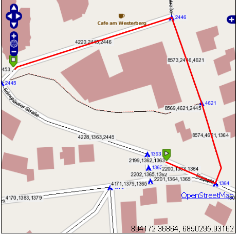

:Author: Kai Behncke (edited Daniel Kastl)
:License: Creative Commons

.. _ol-workshop-ch11:

================================================================
 Killing some bugs (wrong path calculation)
================================================================

At this point you will find out that some routes are not correct.

Please use the following extent in Openlayers

.. code-block:: js

       map.zoomToExtent(new OpenLayers.Bounds(894000, 
                                                   6850300, 
                                                   894500, 
                                                   6850600));
                                                   

For example you get a wrong path like:

What you see in here in blue is the number of the vertices.

The three figures (black on grey) are the gid,the source-id and the target-id 
of a Multilinestring.

By looking at the screenshot obviously the shortest path is via "Edinghäuser Straße",
why is the route so, let`s say "weird"?

The start point is at the Multilinestring with the gid 2200, the source-id is the number 1363.
The end point is at the Multilinestring with the gid 4220, the target_id is 2446.

Iy you the vertives 1363 and 2446 you understand why it goes that path, remember:
The function for this is:

.. code-block:: php

	SELECT gid, the_geom
             FROM dijkstra_sp_delta(
                 '".TABLE."',
                 ".$startEdge['source'].",
                 ".$endEdge['target'].",
                 3000

One solution is to do the calculation "twice", one as seen, and one more the other way round

.. code-block:: php

	SELECT gid, the_geom
             FROM dijkstra_sp_delta(
                 '".TABLE."',
                 ".$endEdge['source'].",
                 ".$startEdge['target'].",
                 3000

What will calculate from node 2445 on the Multilinestring 4220 to 1364 on Multiline 2200.

