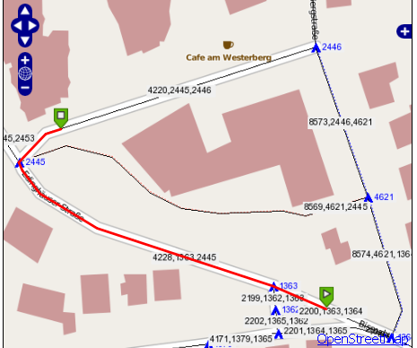

:Author: Kai Behncke (edited Daniel Kastl)
:License: Creative Commons

.. _ol-workshop-ch13:

========================================================================
 Explanation Source Code for Killing some bugs (wrong path calculation)
========================================================================

In the source-code the routing calculation is called twice

.. code-block:: php

	$length_1 = getting_pathlength($startEdge['source'],$endEdge['target'],$startEdge['gid'],$endEdge['gid'],$point_on_line_begin,$point_on_line_ende);

	$length_2 = getting_pathlength($endEdge['source'],$startEdge['target'],$startEdge['gid'],$endEdge['gid'],$point_on_line_begin,$point_on_line_ende);

... and it is calculated how long the pathes are (whole MULTINESTRINGS and the 
"pieces" between start/end_point and the next geometry

It depends on the length which route is painted:

.. code-block:: php

	if ($length_1 < $length_2){

	 $sql = "SELECT rt.gid, AsText(rt.the_geom) AS wkt,
	 	                        ST_Length(rt.the_geom) AS length, ".TABLE.".id
	 	                     FROM ".TABLE.",
	 	                         (SELECT gid, the_geom
	 	                             FROM dijkstra_sp_delta(
	 	                                 '".TABLE."',
	 	                                 ".$startEdge['source'].",
	 	                                 ".$endEdge['target'].",
	 	                                 3000) WHERE gid!=".$startEdge['gid']." AND gid!=".$endEdge['gid']."
	 	                          ) as rt
	 	                     WHERE ".TABLE.".gid=rt.gid;";
	 	                     
	 	  	
	 } 
	else 
	{

	 $sql = "SELECT rt.gid, AsText(rt.the_geom) AS wkt,
	 	                        ST_Length(rt.the_geom) AS length, ".TABLE.".id
	 	                     FROM ".TABLE.",
	 	                         (SELECT gid, the_geom
	 	                             FROM dijkstra_sp_delta(
	 	                                 '".TABLE."',
	 	                                 ".$endEdge['source'].",
	 	                                 ".$startEdge['target'].",
	 	                                 3000) WHERE gid!=".$startEdge['gid']." AND gid!=".$endEdge['gid']."
	 	                          ) as rt
	 	                     WHERE ".TABLE.".gid=rt.gid;";
	 	                     
		                 
	 	                  
	}

And as you see it works:

